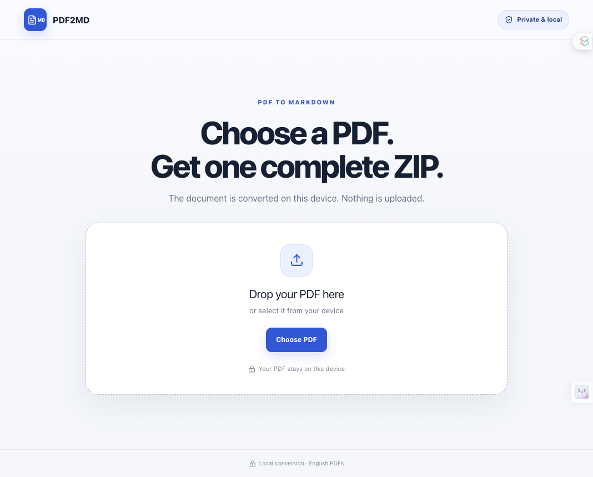
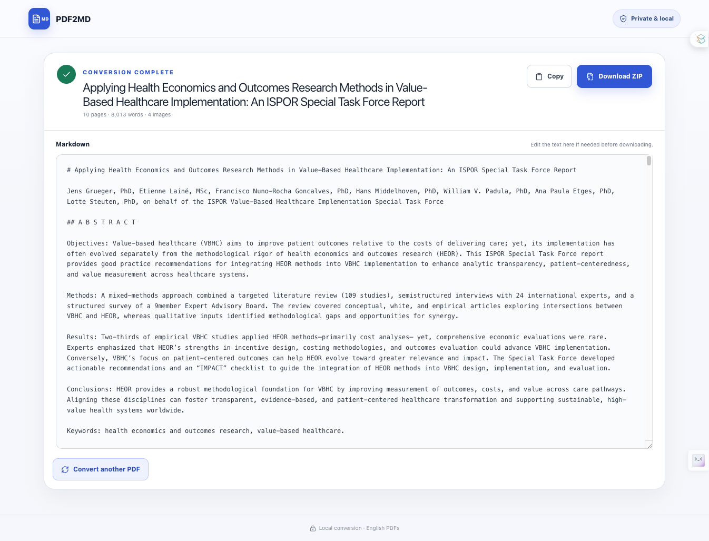

# PDF2MD Converter

PDF2MD Converter turns English academic PDFs into editable Markdown without
uploading the document. It runs in current desktop browsers and as an offline
macOS or Windows application.

[Open PDF2MD Converter](https://converter.pdf2md.workers.dev/)

## Screenshots

### Choose a PDF



### Review and download



## What it handles

- two-column reading order reconstructed as one continuous Markdown flow
- scanned and image-only PDFs using bundled English OCR
- paragraphs continued across page boundaries
- final Markdown continuity audit with targeted original-page reconstruction when sentence fragments are detected
- repeated headers, footers, and page numbers removed
- figures extracted into an `images/` folder and paired with captions
- tables converted to Markdown (or editable Markdown source for correction)
- mathematical symbols converted to LaTeX blocks
- headings, lists, emphasis, links, footnotes, and references retained
- password-protected PDFs
- one continuous Markdown editor instead of a block-review workflow
- one ZIP download containing the Markdown file and an `images/` folder whenever figures are present

## Privacy

PDF content is processed in the browser or desktop webview. The app has no
upload API, analytics, account system, or document storage. OCR language data
and processing code are bundled with the app.

Cloudflare Worker observability, invocation-log persistence, and trace
persistence are explicitly disabled in `wrangler.jsonc`. Cloudflare still
handles normal HTTPS connection metadata at its edge; PDF bytes and converted
content are never sent to the Worker.

The converter accepts PDFs up to 100 MB and 300 pages. It restricts rendered
page dimensions and total canvas memory, restricts script execution with a
Content Security Policy, and does not activate links embedded in PDFs. Only
`http`, `https`, and credential-free `mailto` annotations are retained as inert
Markdown links.

## Responsible use

Only process documents you are authorized to access and reproduce. The MIT
license covers this application's source code, not text, tables, or figures
extracted from third-party documents. Always compare converted Markdown with
the source PDF before citing it, publishing it, analyzing it, or using it for
clinical, regulatory, or other high-stakes decisions.

## Development

Requirements:

- Node.js 22.13 or newer
- Rust (only for desktop packaging)

Install and run the web app:

```bash
npm install
npm run dev
```

Build and verify:

```bash
npm run lint
npm test
npm run desktop:build
npm run deploy:dry-run
```

Run the desktop application:

```bash
npm run desktop dev
```

Create a local desktop bundle:

```bash
npm run desktop build
```

## Cloudflare deployment

Create a dedicated Cloudflare API token limited to the PDF2MD account and the
minimum Worker-script edit permission required by Wrangler. Store it in a
password manager or CI secret—never in the repository—then expose it only to
the deployment process as `CLOUDFLARE_API_TOKEN`. Set
`CLOUDFLARE_ACCOUNT_ID` as well when the token can access more than one
account.

Deploy the tested build with:

```bash
npm run deploy
```

The deployment script rebuilds the app, deploys the generated Worker config,
uses strict conflict checking, and labels the Cloudflare version with the
current Git commit. The Worker name, compatibility date, preview policy, and
disabled observability policy are versioned in `wrangler.jsonc`.

Unsigned macOS and Windows installers are built automatically by GitHub Actions
when a version tag beginning with `v` is pushed.

## Accuracy notes

PDF is a page-painting format rather than a semantic document format. The
converter uses deterministic layout heuristics and OCR, then presents one
continuous Markdown document. Complicated merged-cell tables, multi-panel figures,
specialized mathematical notation, and unusual page layouts may need manual
correction. Representative papers are the best way to improve these heuristics.

## License

[MIT](LICENSE)
